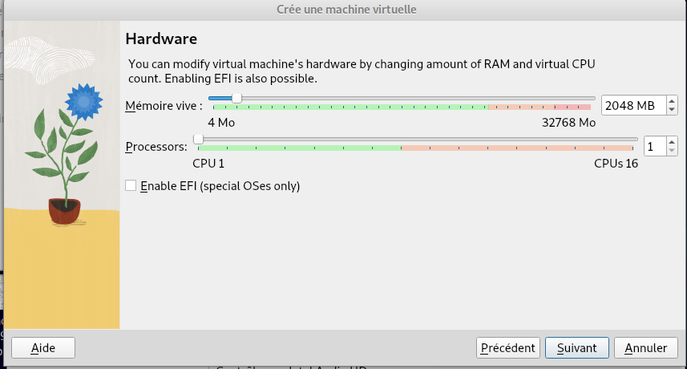

= SAÉ 2.03 -- Rapport n°1 
:description: Rendu de la semaine 3
:doctype: article
:encoding: utf-8
:lang: fr
:experimental:
:icons: font
:data-uri:
:toc: left
:sectnums:
//ifdef::lang[include::attributes-{lang}.adoc[]]
//ifdef::backend-pdf[]
//:pdf-themesdir: themes
//:pdf-theme: sae203
//:pdf-fontsdir: fonts,GEM_FONTS_DIR
//:pdf-page-margin: [15mm, 12mm]
//endif::[]

[[repartition]]
== Introduction 
=== Equipes

Cette SAÉ ce fait par équipe donc nous avons constituer une équipe de 3 :
--
* _FREVILLE Cyprien_
** cyprien.freville.etu@univ-lille.fr
** Groupe D 

* _DECLERCQ Tifaine_
** tifaine.declercq.etu@univ-lille.fr
** Groupe D 

* _GOLLIOT Camille_
** camille.golliot.etu@univ-lille.fr
** Groupe D 
--

=== Semainier

[%header, cols="^.^h,.^3,^.^,^.^", stripes=hover]
|====
^.^| Semaine ^.^| Étape ^.^| Suivi (1h) | Rendu 
| 1-S06 | Préparation VM par pré-configuration | X |
| 2-S07 | Apprentissage balisage léger - base | |
| 3-S08 | Recherche / étude applications clientes | X | X
| 4-S09 3+h|
| 5-S10 | ((Gitea)) : installation & utilisation du service | |
| 6-S11 | Apprentissage balisage léger - style + export | X |
| 7-S12 | - | | X
|====

Nous avons commencer par étudié par le semainier ci-dessus afin de savoir comment nous répartir le travail car le temps d'autaunomie n'était pas suffisant.

[[repartition]]
== Semaine 1 :
=== Installation d'un Marchine Virtuelle manuellement
==== Configuration du squelette de la machine 
Pour installer une machine virtuel il faut d abord un logiciel d unstallation : ici VMbox 
[cols=2]
|===
|
|Ensuite apres l'avoir ouvert on crée une nouvelle machine
|===

[cols=2]
|===
|
|on la nomme sae203 comme demander et on l'install en local afin de remplir notre quota
|===

[cols=3]
|===
|
|
|on laisse les paramètres par défaut pour la mémoire vive, le cpu et le stockage
|===

[cols=2]
|===
|image:images/5.png[5,400,450]
|on vérifie et on valide 
|===

==== Installation de l'iso debian 
On va télécharger l'iso debian sur le site officiel de debian et ensuite on le met dans le même dossier que la VM

[cols=2]
|===
|
|On le choisi dans lecteur optique 
|===

[cols=2]
|===
|
|puis on lance l'installation graphique 
|===

[cols=4]
|===
|
|
|
|On choisi la langue 
|===

[cols=3]
|===
|
|
|On configure le réseau en le nommant comme demander 
|===

[cols=2]
|===
|
|On configure l'utilisateur "root" 
|===

[cols=4]
|===
|
|
|image:images/16.png[16,400,450]
|On configure l'utilisateur "user" 
|===

[cols=4]
|===
|
|
|
|On ne partitionne pas le disque virtuel
|===

[cols=2]
|===
|
|et on valide le tout 
|===

[cols=2]
|===
|
|On choisi le miroir pour la gestion des paquets 
|===

[cols=2]
|===
|
|et on choisi l'environnement de bureau
|===

Et ensuite pour les suppléments invités on va chercher le cd addition dans `usr/share/virtualbox/VBoxGuestAdditions.iso`
Puis on monte le cd `sudo mount /dev/cdrom /mnt`
Enfin on installe les suppléments `sudo /mnt/VBoxLinuxAdditions.run`

On a fini, on redémarre la VM et on se connecte avec le compte utilisateur adéquat. 

==== Les difficultés rencontrées 
Nous avons eu du mal a trouver le disque d installation pour les suppléments invités. 

=== Installation d'un Marchine Virtuelle automatiquement
==== Creation de la machine
On ouvre VMbox 
puis on crée une nouvelle machine avec les même caracteristiques qu'au dessus et on valide 
enfin on va chercher le ".viso". 

[cols=2]
|===
|On modifie le @@UUID@@ avec cette commande
|`sed -i -E "s/(--iprt-iso-maker-file-marker-bourne-sh).*$/\1=$(cat /proc/sys/kernel/random/uuid)/" S203-Debian12.viso`
|===

On insert le fichier dans le lecteur optique comme au dessus et on lance, l'installation se fait automatiquement.
A la fin de l'installation on arrive sur un bureau sans graphisme. 

[cols=2]
|===
|On installe un environnement de bureau 
|`apt install mate-desktop-environment`
|
|`apt install mate-tweak`
|===

[cols=2]
|===
|enfin on redémarre la machine virtuel 
|`shutdown -r now`
|===

Voila notre environnement est créé avec un bureau graphique.

==== Installation des packages 
Il faut d'abord mettre a jour les packages d'installation avant de commencer à en installer de nouveau, 
pour cela il faut utiliser la commande suivante : `apt-get update`

[cols=2]
|===
|Installer les packages sudo 
|`apt install sudo`
|===

[cols=2]
|===
|Installer git 
|`apt install git-all`
|===

[cols=2]
|===
|Installer sqlite3
|`apt-get install sqlite3`
|===

[cols=2]
|===
|Installer curl 
|`apt-get install curl`
|===

[cols=2]
|===
|Installer -completion 
|`apt-get install -completion`
|===

[cols=2]
|===
|Installer neofetch
|`apt install neofetch`
|===

Et ensuite pour les supplements invités on va chercher le cd addition dans `usr/share/virtualbox/VBoxGuestAdditions.iso`
Puis on monte le cd `sudo mount /dev/cdrom /mnt`
Enfin on installe les supplements `sudo /mnt/VBoxLinuxAdditions.run`

==== Les difficultés rencontrées 

Nous avons eu du mal avec la commande pour modifier le @@UUID@@ car il y avait un retour à la ligne au lieu d'un espace, et le même problème pour les suppléments invités. 

=== Quelques questions
==== Preparation de la machine virtuelle 

[cols=2]
|===
|Que signifie “64-bit” dans “Debian 64-bit” ?
|"64-bit" dans "Debian 64-bit" se réfère à l'architecture du processeur. Les processeurs 64 bits peuvent traiter des données et des instructions plus grandes que les processeurs 32 bits, offrant ainsi une meilleure performance et une prise en charge de plus de mémoire.
|Quelle est la configuration réseau utilisée par défaut ?
|La configuration NAT : les VM connectées à un même réseau NAT peuvent communiquer entre elles, et elles peuvent aussi accéder à Internet grâce au NAT.
|Quel est le nom du fichier XML contenant la configuration de votre machine ?
|Le nom du fichier XML contenant la configuration de la machine dépend du type d'hyperviseur utilisé. Ici c'est VirtualBox.xml ($HOME/.config/VirtualBox.xml)
| Sauriez-vous le modifier directement ce fichier de configuration pour mettre 2 processeurs à votre machine ?
|Non, il n’y a pas d’informations sur les processeurs que l’on peut modifier. Et ce n’est pas conseillé de modifier quelque chose dans ce fichier car il est généré et géré par VirtualBox lui-même.
|===

==== Installation de l 'os 

[cols=2]
|===
|Qu’est-ce qu’un fichier iso bootable ?
|Un fichier ISO bootable est une image disque au format ISO conçue pour être utilisée comme support d'installation pour un système d'exploitation. Il contient tous les fichiers nécessaires pour démarrer et installer le système sur un ordinateur. https://www.diskpart.com/fr/articles/c-est-quoi-une-cle-usb-bootable-0904-gc.html
|Qu’est-ce que MATE ? GNOME ?
|MATE et GNOME sont des environnements de bureau pour les systèmes d'exploitation Linux. Ce sont des interfaces graphiques qui fournissent un moyen convivial d'interagir avec le système. MATE est une continuation de l'environnement GNOME 2, tandis que GNOME (GNU Network Object Model Environment) est un environnement de bureau moderne pour les systèmes UNIX. https://debian-facile.org/doc:environnements:mate
|Qu’est-ce qu’un serveur web ?
|Un serveur web est un logiciel qui répond aux requêtes HTTP provenant de clients, généralement des navigateurs web. Il gère la livraison de pages web, de fichiers et d'autres contenus sur Internet. Des exemples de serveurs web incluent Apache, Nginx et Microsoft IIS. Par serveur Web (aussi appelé serveur http), on entend tout type de serveur qui permet de diffuser des contenus Web sur Internet ou Intranet.  En tant que partie d’un réseau d’ordinateurs, un serveur Web transmet des documents (d’une page Web à un navigateur par exemple) à ce qu’on appelle un client.  https://www.ionos.fr/digitalguide/serveur/know-how/serveur-web-definition-bases-astuces-et-logiciels/
|Qu’est-ce qu’un serveur ssh ?
|Un serveur SSH (Secure Shell) permet une connexion sécurisée à distance à un système. Il utilise le protocole SSH pour crypter les communications entre le client et le serveur, assurant ainsi une sécurité accrue lors de l'accès à distance à des machines. https://www.it-connect.fr/chapitres/quest-ce-que-ssh/
|Qu’est-ce qu’un serveur mandataire ?
|Un serveur mandataire (proxy server) agit comme un intermédiaire entre les clients et les serveurs. Il peut être utilisé pour diverses tâches, telles que la mise en cache de contenu, le filtrage d'URL, l'anonymisation des requêtes, et la gestion des connexions réseau. Les serveurs mandataires sont souvent utilisés pour améliorer les performances, la sécurité ou la confidentialité. https://www.techno-science.net/definition/3812.html
|===

==== Acces sudo pour user 

[cols=2]
|===
|Comment peut-on savoir à quels groupes appartient l'utilisateur “user” ?
|Pour savoir à quel groupe appartient l'utilisateur “user”, il suffit de rentrer la commande : `cat /etc/group` dans le terminal, il vous affichera tous les groupes.
|===

==== Installation des supplement invités 

[cols=2]
|===
|Quelle est la version du noyau Linux utilisé par votre VM ? N’oubliez pas, comme pour toutes les questions, de justifier votre réponse.
|Notre VM utilise un noyau Linux 6.1 https://www.debian.org/release/stable/386!:release-notes/ch-whats-new.fr.html
|À quoi servent les suppléments invités ? Donner 2 principales raisons de les installer.
|Les suppléments invités servent a l'integration du ponteur de la souris ainsi que pour les connexion automatisées 
|À quoi sert la commande mount (dans notre cas de figure et dans le cas général) ?
|La commande "mount" demande au système d'exploitation de rendre un systeme de fichier accessible à un emplacement specifier https://manpages.debian.org/testing/manpages-fr/mount.8.fr.html
|===

==== Quelques questions 

[cols=2]
|===
|Qu’est-ce que le Projet Debian ? D’où vient le nom Debian ? (La maintenance)
|Le Projet Debian est une association de personnes qui travaillent volontairement pour créer un système d'exploitation basé sur le logiciel libre. Le nom "Debian" est dérivé des prénoms du fondateur du projet, Ian Murdock, et de sa femme, Debra. https://www.debian.org/doc/manuals/project-history/intro.fr.html
|Il existe 3 durées de prise en charge (support) de ces versions : la durée minimale, la durée en support long terme (LTS) et la durée en support long terme étendue (ELTS). Quelles sont les durées de ces prises en charge ?
|La prise en charge à long terme étendue (ELTS) est une offre commerciale offrant un prolongement de la durée de vie de 10 ans des versions de Debian (c'est-à-dire de 5 ans après la prise en charge de 5 ans offerte par le projet LTS). Il ne s'agit pas d'un projet officiel de Debian. L'infrastructure de Debian, et les autres ressources de Debian ne sont pas impliquées. https://wiki.debian.org/fr/LTS/Extended
|Pendant combien de temps les mises à jour de sécurité seront-elles fournies ? (Nom générique, nom de code et version)
|L'équipe chargée de la sécurité prend en charge la distribution stable pendant trois années après sa publication. Il n'est pas possible de prendre en charge trois distributions, c'est déjà bien assez difficile avec deux. https://www.debian.org/security/faq.fr.html#lifespan
|Combien de versions au minimum sont activement maintenues par Debian ? Donnez leur nom générique (= les types de distribution).
|Debian maintient au minimum trois versions : stable, testing, et unstable. https://www.debian.org/releases/index.fr.html
|Chaque distribution majeure possède un nom de code différent. Par exemple, la version majeure actuelle (Debian 12) se nomme bookworm. D’où viennent les noms de code données aux distributions ?
|Les noms de code des distributions Debian sont généralement tirés du film "Toy Story". Ils sont choisis par l'équipe de publication de Debian en interne. https://www.debian.org/doc/manuals/debian-faq/ftparchives.fr.html
|L’un des atouts de Debian fut le nombre d’architecture (≈ processeurs) officiellement prises en charge. Combien et lesquelles sont prises en charge par la version Bullseye ?
|La version Bullseye (Debian 11) prend en charge 10 architectures officielles : amd64, arm64, armel, armhf, i386, ia64, mips, powerpc, ppc64el et s390x (https://www.debian.org/doc/manuals/debian-faq/compatibility.fr.html#arches)
|Première version avec un nom de code: Quel a était le premier nom de code utilisé ? Quand a-t-il été annoncé ? Quel était le numéro de version de cette distribution ?
|Première version avec un nom de code : Nom de code : "Buzz"  Annoncé le : 17 juin 1996  Version : Debian 1.1 https://www.debian.org/doc/manuals/project-history/releases.fr.html
|Dernière nom de code attribué: Quel est le dernier nom de code annoncé à ce jour ? Quand a-t-il été annoncé ? Quelle est la version de cette distribution ?
|Dernier nom de code annoncé à ce jour : Nom de code : "Bookworm" Annoncé le : 10 juin 2023 Version : Debian 12 https://www.debian.org/doc/manuals/project-history/releases.fr.html
|===

[[repartition]]
== Semaine 2 :
Un des objectifs de la sae 2.03 est nous apprendre un langage de balisage utile pour la crétion de documentation mais pas que.
[%hardbreaks]
Pour montrer ce que nous avons appris, nous avons fait ce rapport entierement en #asciidoctor#, pour le moment il contient : 

. du texte en gras 
. de l'insertion de code source 
. de l'insertion de lien cliquable 
. des images avec modification de leur taille initiale 
. un tableau complexe ( le semainier )
. des listes 
.. Ordonnée 
.. non ordonnée 
. un sommaire automatique

Donc pour le rapport final nous devons encore mettre en place : 

* le css 
** mettre une page de garde
** changer la police d'ecriture si possible 
*** couleur
*** font-family
* la gestion de multifichier 
* refaire un tableau complexe 
* refaire la mise en page des rapport a integrer dans le rapport final avec les connaisse apprise en plus 
* liste avec sous liste integrée 

Nous avions de choix à notre disposition 2 formats au choix:

<<<

* Le format https://daringfireball.net/projects/markdown/[((Markdown))] dans sa version étendue par le logiciel https://pandoc.org/MANUAL.html#pandocs-markdown[((pandoc))]
* Le format https://docs.asciidoctor.org/[((Asciidoctor))] (version étendue du format AsciiDoc) 

Nous avons fini par choisir le format #Asciidoctor# car selon notre professeur il est plus complet et demande moins d'extension que le *Markdown*.

=== Installation de Asccidoctor
Avant d'installer *Asccidoctor* nous avons du installer le *RubyInstaller*.
Pour cela nous sommes simplement aller sur le site de https://rubyinstaller.org/downloads/[((RubyInstaller))] et avons cliquer sur installé, cela ne fonctionne que pour *Windows*.
Pour *Debian* il suffit de taper la commande :
`sudo apt-get install ruby-full`

Ensuite une fois ruby installé nous avons dû executer une commande dans le *RubyInstaller*.
`gem install asciidoctor`

Afin de vérifier la réussite de l'installation il a fallu faire : `asciidoctor --version`

=== Installation de asciidoctor-pdf
Pour installer *asciidoctor-pdf* nous avons dû executer une commande dans le *RubyInstaller*. `gem install asciidoctor-pdf`

Asciidoctor-PDF est une extension d'Asciidoctor qui permet de générer des documents au format PDF à partir de contenu rédigé en AsciiDoc.

=== Commande utile 
Commande pour convertir un fichier en asciidoctor en pdf : 

* Il faut se mettre dans le dossier qui contient le fichier *.adoc* et ecrire : 

** directement dans sont terminal si on est sous *Linux* 
** dans le terminal en passant par *RubyInstaller* si on est sous *Windows*

et taper `asciidoctor-pdf <nom_du_fichier>`

Commande pour convertir un fichier en asciidoctor en html : 

* Il faut se mettre dans le dossier qui contient le fichier *.adoc* et ecrire : 

** directement dans sont terminal si on est sous *Linux* 
** dans le terminal en passant par *RubyInstaller* si on est sous *Windows*

et taper `asciidoctor <nom_du_fichier>`

[[repartition]]
== Semaine 3 :

=== Questions 

[cols=2]
|===
|Qu’est-ce que le logiciel gitk ? Comment se lance-t-il ? 
|Gitk est un navigateur de dépôt graphique, le premier de son genre. Il peut être considéré comme un encapsuleur graphique pour git log. Il permet d'explorer et de visualiser l'historique d'un dépôt. Il est écrit en tcl/tk, ce qui le rend portable sur tous les systèmes d'exploitation.  pour lancer gitk il suffit de taper `gitk&` dans le terminal https://www.atlassian.com/fr/git/tutorials/gitk
|===

[cols=2]
|===
|Qu’est-ce que le logiciel git-gui ? Comment se lance-t-il ? 
|Interface graphique de Git basée sur Tcl/Tk. Git-gui permet aux utilisateurs d’apporter des modifications à leur dépôt en faisant de nouveaux commits, en modifiant les commits existants, en créant des branches, en effectuant des fusions locales, et en récupérant/poussant vers des dépôts distants. Contrairement à gitk, git gui se concentre sur la génération de commit et l’annotation de fichiers uniques et n’affiche pas l’historique du projet. Il fournit cependant des actions de menu pour démarrer une session gitk à partir de git gui. pour lancer gut gui il suffit de taper `git gui` dans le terminal https://git-scm.com/docs/git-gui/fr
|===

==== Installation d'un autre outils

[cols=2]
|===
|Pourquoi avez-vous choisi ce logiciel ?
|Nous avons choisi GitKraken car c’est le logiciel le plus utilisé dans le monde professionnel, il a une grosse documentation comparé à ses camarades, et c’est surtout un logiciel multiplateforme (Windows, Linux, …)
|Comment l'avez-vous installé ?
|Commande d’installation de GitKraken : `wget https://release.gitkraken.com/linux/gitkraken-amd64.deb sudo apt install gitkraken-amd64.deb`
|Comparez-le aux outils inclus avec git (et installé précédemment) ainsi qu’avec ce qui serait fait en ligne de commande pure : fonctionnalités avantages, inconvénients…
|
|===

== Conclusion

Dans cette premiere partie de sae, nous avons su cree 2 machines virtuelle de 2 manieres differentes (automatiquement et manuellement) et nous avons commencé a prendre en main le asciidoctor pour faire ce premier rapport.

//ifdef::backend-pdf[]
//[index]
//= Index
//endif::[]